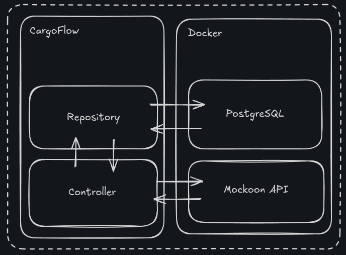
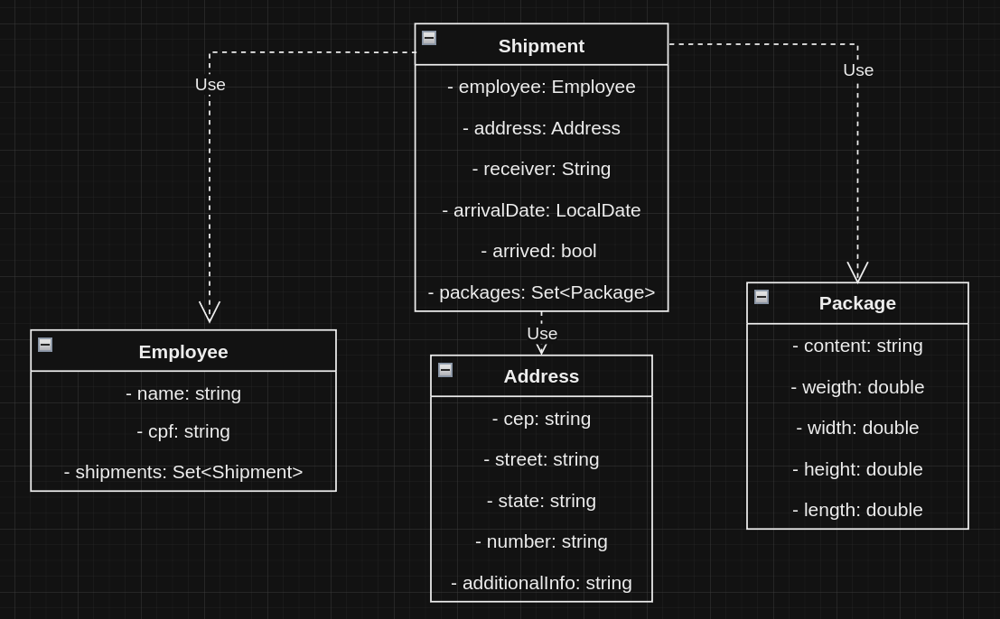
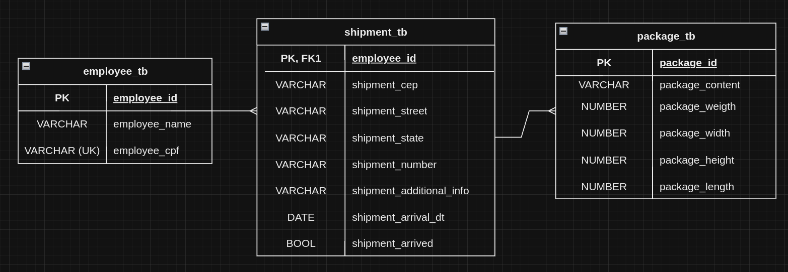

<h1 align="center">CargoFlow</h1>

Esse projeto simula um gerenciador de entregas. A aplicação foi criada com Java usando o Framework SpringMVC.

> [!IMPORTANT]
> Para executar esse projeto são necessárias as ferramentas:
> - JDK 21
> - Maven
> - Docker 
>
> O Projeto usa os seguintes ports:
> - `8080`
> - `3001`
> - `5432`
> 
> **Caso algum desses ports estejam indispovíveis o projeto não poderá ser executado.**

<br/>

<h1 align="center">Executando o projeto</h1>

```
git clone https://github.com/DabGias/CargoFlow

cd CargoFlow

mvn compile

mvn package -Dmaven.test.skip

docker compose build

docker compose up
```

Após inicializado, acesse: http://localhost:8080/shipments

<br/>

<h1 align="center">Arquitetura Geral</h1>

<div align="center">
    
</div>

<br/>

<h1 align="center">Diagrama de Classes</h1>

<div align="center">
    
</div>

<br/>

<h1 align="center">Relacionamento das Entidades</h1>

<div align="center">
    
</div>
